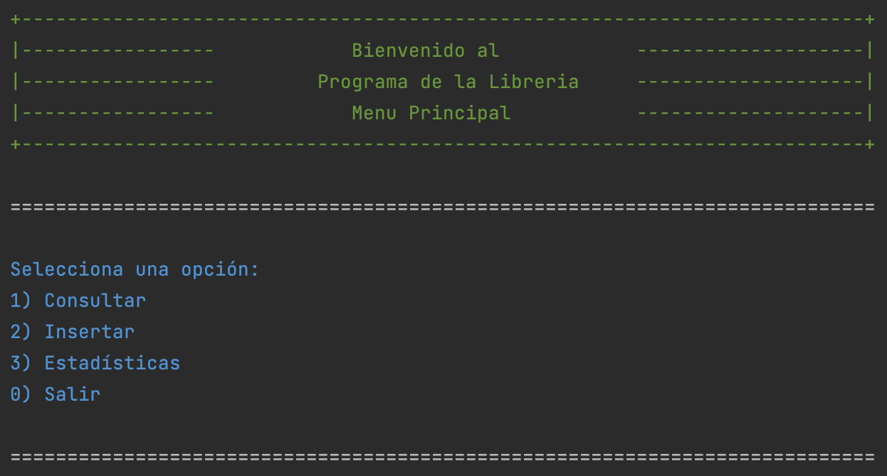
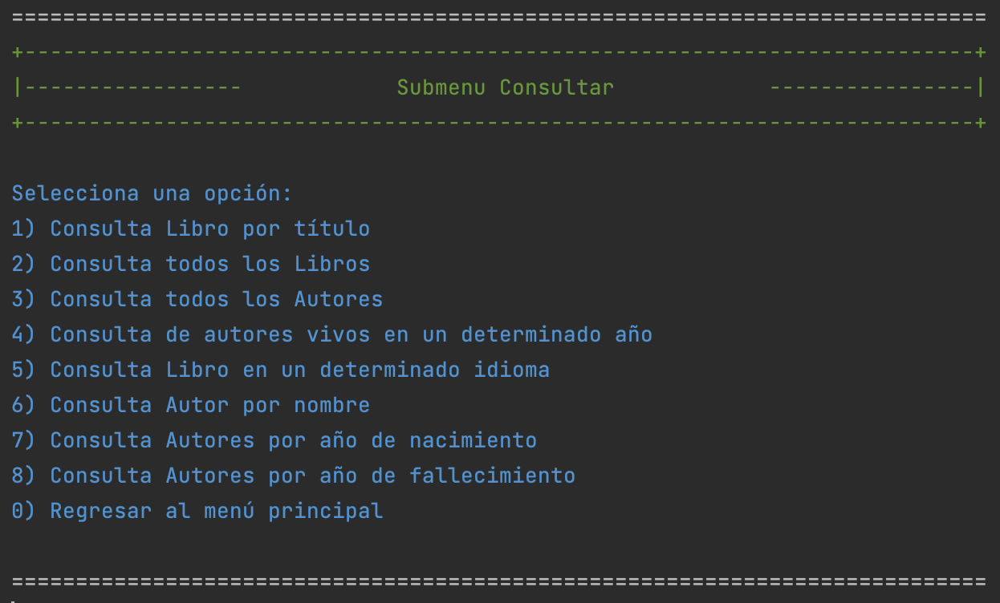

# 📚 Proyecto Librería: LiterAlura


---

## 📝 Descripción

Este proyecto es un cliente para invocar la **API RESTful** 'https://gutendex.com/books' diseñada para consultar libros. Incluye funcionalidades para:

- 📖 **Gestión de libros**: registro de libros y consulta por varios parámetros.
- ✍️ **Gestión de autores**: registro y consulta de autores.
- 🗂️ **Estadísticas**: Top 10 libros más descargados.

La aplicación está desarrollada con tecnologías modernas y sigue principios de diseño limpio, escalabilidad y buenas prácticas.

---

## ⚙️ Tecnologías Utilizadas

- **JDK 17**: Lenguaje de programación java.
- **Spring Boot**: Framework para el desarrollo de aplicaciones basadas en Java.
- **Gradle**: Herramienta para la gestión de dependencias y construcción del proyecto.
- **PostgreSQL**: Base de datos relacional para el almacenamiento de datos de libros y autores.
- **GitHub**: Repositorio para el control de versiones y colaboración.

---

## 🚀 Funcionalidades

### 🌟 Funcionalidades implementadas:
- Consulta por título
- Consultar todos los libros.
- Consultar todos los autores.
- Consulta de autores vivos en un determinado año.
- Consulta Libro en un determinado idioma.
- Consulta Autor por nombre.
- Consulta Autores por año de nacimiento.
- Consulta Autores por año de fallecimiento
- Insertar Libro.
- Top 10 libros más descargados.

---

## 🛠️ Requisitos Previos

1. **Java 17** o superior.
2. **Gradle 7.0+**.
3. **PostgreSQL 13+**.
4. **Git** instalado.

---
### 📥 Clonar el Repositorio
```bash
git clone https://github.com/tu-usuario/tu-repositorio.git
cd tu-repositorio
```

### 📂 Estructura del proyecto
```
src/
├── main/
│   ├── java/valverde/com/mx/literalura/
│   │   ├── util/          # Clase de utilería
│   │   ├── models/        # Entidades JPA
│   │   ├── repositories/  # Interfaces de acceso a datos
│   │   ├── services/      # Lógica de negocio
│   └── resources/
│       ├── application.properties  # Configuración de Spring
├── test/  # Pruebas unitarias e integración
```

---

## 🚀 Instrucciones de Configuración

### 🛠 Configuración de la Base de datos
```properties
spring.datasource.url=jdbc:postgresql://localhost:5432/literalura
```

### ⚡ Crear el archivo Jar
```bash
./gradlew bootJar
```

- Ejecuta el programa con alguna de las opciones del menú:
- 1 - Consultar
- 2 - Insertar
- 3 - Estadísticas

```bash
java -jar build/libs/LiterAlura-1.0.jar --server.port=8080
```

## 📖 Opciones al ejecutar el programa
### Menú Principal


### Submenú



### 🛡️ Licencia
Este proyecto está licenciado bajo la MIT License

---
### 💻 Desarrollado por:
- Nombre: Mariela Guadalupe Valverde Benítez
- Email: marielavalverdeb@gmail.com
- LinkedIn: https://www.linkedin.com/in/marielavalverdeb/

